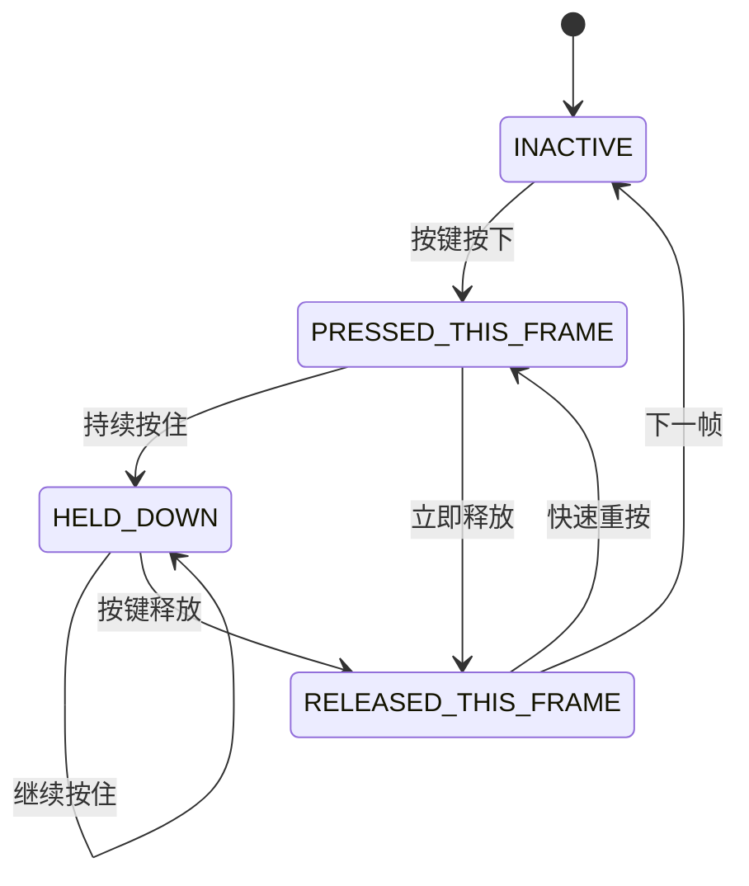

# 输入管理类

<div class="video-container">
  <div id="bilibili" class="video-content">
    <!-- B站嵌入：使用 https 明确协议（避免 file:// 或 http 导致被浏览器拦截） -->
    <iframe
      class="video-frame"
      src="https://player.bilibili.com/player.html?bvid=BV1ts3FzxEje&page=1&autoplay=0&danmaku=0&high_quality=1"
      width="100%"
      height="480"
      scrolling="no"
      frameborder="0"
      allowfullscreen>
    </iframe>
  </div>
</div>

[在 Bilibili 上观看](https://www.bilibili.com/video/BV1ts3FzxEje)

## 📌 问题背景

到目前为止，我们已经能渲染出漂亮的画面，但游戏世界还是静悄悄的——我们无法与之交互。是时候打破这片沉寂，为引擎装上 **"神经系统"** 了。本节课，我们将构建一个强大且高度可配置的输入管理模块 `InputManager`。

### 设计目标


我们的目标是建立一个系统，它能：

- 🎯 **抽象化输入**：游戏逻辑不应该关心玩家按的是"W键"还是"手柄上摇杆"。它只关心"向上移动"这个动作（Action）。我们将把具体的物理按键（键盘、鼠标、手柄）映射到抽象的游戏动作上
- ⚙️ **易于配置**：所有的按键映射都将定义在我们的 `config.json` 文件中，玩家（或开发者）可以轻松修改键位，而无需改动一行代码
- 📊 **精确的状态管理**：区分"刚刚按下"、"持续按住"和"刚刚释放"这三种状态对于实现某些游戏机制（如跳跃、蓄力攻击）至关重要

> 💡 我们将分两步来完成这个模块：首先实现一个功能完整的版本，然后利用现代 C++ 的特性对其进行一次优雅的重构。

---

## 第一步：构建功能完备的 InputManager

### 1. 架构设计

`InputManager` 将成为我们处理所有输入的唯一入口。它的核心工作流程如下：

#### 工作流程

| 阶段 | 说明 |
|------|------|
| **初始化** | 在构造时，从 `Config` 模块读取 `input_mappings`。然后，它会建立两个反向映射表：一个是从 `SDL_Scancode`（键盘按键）到动作列表，另一个是从 `Uint8`（鼠标按钮）到动作列表 |
| **每帧更新** | 在游戏主循环的最开始被调用。它会处理所有 SDL 事件队列中的事件（如 `SDL_EVENT_KEY_DOWN`），并据此更新内部所有动作的状态 |
| **状态查询** | 提供 `isActionDown()`, `isActionPressed()`, `isActionReleased()` 等接口，供游戏逻辑的其他部分查询特定动作的当前状态 |

---

### 2. 动作状态机 ActionState

为了精确捕捉按键的每一个瞬间，我们定义了一个枚举类 `ActionState`：

```cpp
enum class ActionState {
    INACTIVE,              // 未激活
    PRESSED_THIS_FRAME,    // 在当前帧刚刚被按下
    HELD_DOWN,             // 在前一帧被按下后，持续按住
    RELEASED_THIS_FRAME    // 在当前帧刚刚被释放
};
```

#### 状态转换说明

`InputManager::update()` 方法会负责在这个状态机之间进行正确的转换。例如，上一帧是 `PRESSED_THIS_FRAME` 的动作，如果在本帧没有收到"释放"事件，它的状态就会自动变为 `HELD_DOWN`。



---

### 3. 实现 InputManager

我们在 `src/engine/` 下创建 `input` 目录，并添加 `input_manager.h` 和 `input_manager.cpp`。

#### input_manager.h

```cpp
#pragma once
#include <string>
#include <unordered_map>
#include <vector>
#include <SDL3/SDL_render.h>
#include <glm/vec2.hpp>

namespace engine::core {
    class Config;
}

namespace engine::input {

enum class ActionState {
    INACTIVE,           ///< @brief 动作未激活
    PRESSED_THIS_FRAME, ///< @brief 动作在本帧刚刚被按下
    HELD_DOWN,          ///< @brief 动作被持续按下
    RELEASED_THIS_FRAME ///< @brief 动作在本帧刚刚被释放
};

class InputManager final {
private:
    SDL_Renderer* sdl_renderer_;                                            ///< @brief 用于获取逻辑坐标的 SDL_Renderer 指针
    std::unordered_map<std::string, std::vector<std::string>> actions_to_keyname_map_;      ///< @brief 存储动作名称到按键名称列表的映射
    std::unordered_map<SDL_Scancode, std::vector<std::string>> scancode_to_actions_map_;///< @brief 从键盘（Scancode）到关联的动作名称列表
    std::unordered_map<Uint8, std::vector<std::string>> mouse_button_to_actions_map_;   ///< @brief 从鼠标按钮 (Uint8) 到关联的动作名称列表

    std::unordered_map<std::string, ActionState> action_states_;    ///< @brief 存储每个动作的当前状态

    bool should_quit_ = false;                                      ///< @brief 退出标志
    glm::vec2 mouse_position_;                                      ///< @brief 鼠标位置 (针对屏幕坐标)

public:
    /**
     * @brief 构造函数
     * @param sdl_renderer 指向 SDL_Renderer 的指针
     * @param config 配置对象
     * @throws std::runtime_error 如果任一指针为 nullptr。
     */
    InputManager(SDL_Renderer* sdl_renderer, const engine::core::Config* config);

    void update();                                    ///< @brief 更新输入状态，每轮循环最先调用


    // 动作状态检查
    bool isActionDown(const std::string& action_name) const;        ///< @brief 动作当前是否触发 (持续按下或本帧按下)
    bool isActionPressed(const std::string& action_name) const;     ///< @brief 动作是否在本帧刚刚按下
    bool isActionReleased(const std::string& action_name) const;    ///< @brief 动作是否在本帧刚刚释放

    bool shouldQuit() const;                                         ///< @brief 查询退出状态
    void setShouldQuit(bool should_quit);                            ///< @brief 设置退出状态

    glm::vec2 getMousePosition() const;                              ///< @brief 获取鼠标位置 （屏幕坐标）
    glm::vec2 getLogicalMousePosition() const;                       ///< @brief 获取鼠标位置 （逻辑坐标）

private:
    void processEvent(const SDL_Event& event);                      ///< @brief 处理 SDL 事件（将按键转换为动作状态）
    void initializeMappings(const engine::core::Config* config);                            ///< @brief 根据 Config配置初始化映射表
    
    void updateActionState(const std::string& action_name, bool is_input_active, bool is_repeat_event); ///< @brief 辅助更新动作状态
    SDL_Scancode scancodeFromString(const std::string& key_name);                           ///< @brief 将字符串键名转换为 SDL_Scancode
    Uint8 mouseButtonUint8FromString(const std::string& button_name);                       ///< @brief 将字符串按钮名转换为 SDL_Button
};

} // namespace engine::input 
```

定义了 `InputManager` 的接口，包括状态查询函数和私有的映射表。

#### input_manager.cpp

```cpp
#include "input_manager.h"
#include "../core/config.h"
#include <stdexcept>
#include <SDL3/SDL.h>
#include <spdlog/spdlog.h>
#include <glm/vec2.hpp>


namespace engine::input {

InputManager::InputManager(SDL_Renderer* sdl_renderer, const engine::core::Config* config): sdl_renderer_(sdl_renderer) {
    if (!sdl_renderer_) {
        spdlog::error("输入管理器: SDL_Renderer 为空指针");
        throw std::runtime_error("输入管理器: SDL_Renderer 为空指针");
    }
    initializeMappings(config);
    // 获取初始鼠标位置
    float x, y;
    SDL_GetMouseState(&x, &y);
    mouse_position_ = {x, y};
    spdlog::trace("初始鼠标位置: ({}, {})", mouse_position_.x, mouse_position_.y);
}

// --- 更新和事件处理 ---

void InputManager::update() {
    // 1. 根据上一帧的值更新默认的动作状态
    for (auto& [action_name, state] : action_states_) {
        if (state == ActionState::PRESSED_THIS_FRAME) {
            state = ActionState::HELD_DOWN;                 // 当某个键按下不动时，并不会生成SDL_Event。
        } else if (state == ActionState::RELEASED_THIS_FRAME) {
            state = ActionState::INACTIVE;
        }
    }

    // 2. 处理所有待处理的 SDL 事件 (这将设定 action_states_ 的值)
    SDL_Event event;
    while (SDL_PollEvent(&event)) {
        processEvent(event);
    }
}

void InputManager::processEvent(const SDL_Event& event) {
    switch (event.type) {
        case SDL_EVENT_KEY_DOWN:
        case SDL_EVENT_KEY_UP: {
            SDL_Scancode scancode = event.key.scancode;     // 获取按键的scancode
            bool is_down = event.key.down; 
            bool is_repeat = event.key.repeat;

            auto it = scancode_to_actions_map_.find(scancode);
            if (it != scancode_to_actions_map_.end()) {     // 如果按键有对应的action
                const std::vector<std::string>& associated_actions = it->second;
                for (const std::string& action_name : associated_actions) {
                    updateActionState(action_name, is_down, is_repeat); // 更新action状态
                }
            }
            break;
        }
        case SDL_EVENT_MOUSE_BUTTON_DOWN:
        case SDL_EVENT_MOUSE_BUTTON_UP: {
            Uint8 button = event.button.button;              // 获取鼠标按钮
            bool is_down = event.button.down;
            auto it = mouse_button_to_actions_map_.find(button);
            if (it != mouse_button_to_actions_map_.end()) {     // 如果鼠标按钮有对应的action
                const std::vector<std::string>& associated_actions = it->second;
                for (const std::string& action_name : associated_actions) {
                    // 鼠标事件不考虑repeat, 所以第三个参数传false
                    updateActionState(action_name, is_down, false); // 更新action状态
                }
            }
            // 在点击时更新鼠标位置
            mouse_position_ = {event.button.x, event.button.y};
            break;
        }
        case SDL_EVENT_MOUSE_MOTION:        // 处理鼠标运动
            mouse_position_ = {event.motion.x, event.motion.y};
            break;
        case SDL_EVENT_QUIT:
            should_quit_ = true;
            break;
        default:
            break;
    }
}

// --- 状态查询方法 ---

bool InputManager::isActionDown(const std::string& action_name) const {
    // C++17 引入的 “带有初始化语句的 if 语句”
    if (auto it = action_states_.find(action_name); it != action_states_.end()) {
        return it->second == ActionState::PRESSED_THIS_FRAME || it->second == ActionState::HELD_DOWN;
    }
    return false;
}

bool InputManager::isActionPressed(const std::string& action_name) const {
    if (auto it = action_states_.find(action_name); it != action_states_.end()) {
        return it->second == ActionState::PRESSED_THIS_FRAME;
    }
    return false;
}

bool InputManager::isActionReleased(const std::string& action_name) const {
    if (auto it = action_states_.find(action_name); it != action_states_.end()) {
        return it->second == ActionState::RELEASED_THIS_FRAME;
    }
    return false;
}

bool InputManager::shouldQuit() const {
    return should_quit_;
}

void InputManager::setShouldQuit(bool should_quit)
{
    should_quit_ = should_quit;
}

glm::vec2 InputManager::getMousePosition() const
{
    return mouse_position_;
}

glm::vec2 InputManager::getLogicalMousePosition() const
{
    glm::vec2 logical_pos;
    // 通过窗口坐标获取渲染坐标（逻辑坐标）
    SDL_RenderCoordinatesFromWindow(sdl_renderer_, mouse_position_.x, mouse_position_.y, &logical_pos.x, &logical_pos.y);
    return logical_pos;
}

// --- 初始化输入映射 ---

void InputManager::initializeMappings(const engine::core::Config* config) {
    spdlog::trace("初始化输入映射...");
    if (!config) {
        spdlog::error("输入管理器: Config 为空指针");
        throw std::runtime_error("输入管理器: Config 为空指针");
    }
    actions_to_keyname_map_ = config->input_mappings_;      // 获取配置中的输入映射（动作 -> 按键名称）
    scancode_to_actions_map_.clear();
    mouse_button_to_actions_map_.clear();
    action_states_.clear();

    // 如果配置中没有定义鼠标按钮动作(通常不需要配置),则添加默认映射, 用于 UI
    if (actions_to_keyname_map_.find("MouseLeftClick") == actions_to_keyname_map_.end()) {
         spdlog::debug("配置中没有定义 'MouseLeftClick' 动作,添加默认映射到 'MouseLeft'.");
         actions_to_keyname_map_["MouseLeftClick"] = {"MouseLeft"};     // 如果缺失则添加默认映射
    }
     if (actions_to_keyname_map_.find("MouseRightClick") == actions_to_keyname_map_.end()) {
         spdlog::debug("配置中没有定义 'MouseRightClick' 动作,添加默认映射到 'MouseRight'.");
         actions_to_keyname_map_["MouseRightClick"] = {"MouseRight"};   // 如果缺失则添加默认映射
    }
    // 遍历 动作 -> 按键名称 的映射
    for (const auto& [action_name, key_names] : actions_to_keyname_map_) {
        // 每个动作对应一个动作状态，初始化为 INACTIVE
        action_states_[action_name] = ActionState::INACTIVE;
        spdlog::trace("映射动作: {}", action_name);
        // 设置 "按键 -> 动作" 的映射
        for (const std::string& key_name : key_names) {
            SDL_Scancode scancode = scancodeFromString(key_name);       // 尝试根据按键名称获取scancode
            Uint8 mouse_button = mouseButtonUint8FromString(key_name);  // 尝试根据按键名称获取鼠标按钮
            // 未来可添加其它输入类型 ...

            if (scancode != SDL_SCANCODE_UNKNOWN) {      // 如果scancode有效,则将action添加到scancode_to_actions_map_中
                scancode_to_actions_map_[scancode].push_back(action_name);     
                spdlog::trace("  映射按键: {} (Scancode: {}) 到动作: {}", key_name, static_cast<int>(scancode), action_name);
            } else if (mouse_button != 0) {             // 如果鼠标按钮有效,则将action添加到mouse_button_to_actions_map_中
                mouse_button_to_actions_map_[mouse_button].push_back(action_name); 
                spdlog::trace("  映射鼠标按钮: {} (Button ID: {}) 到动作: {}", key_name, static_cast<int>(mouse_button), action_name);
                // else if: 未来可添加其它输入类型 ...
            } else {
                spdlog::warn("输入映射警告: 未知键或按钮名称 '{}' 用于动作 '{}'.", key_name, action_name);
            }
        }
    }
    spdlog::trace("输入映射初始化完成.");
}

// --- 工具函数 ---
// 将字符串名称转换为 SDL_Scancode
SDL_Scancode InputManager::scancodeFromString(const std::string& key_name) {
    return SDL_GetScancodeFromName(key_name.c_str());
}

// 将鼠标按钮名称字符串转换为 SDL 按钮 Uint8 值
Uint8 InputManager::mouseButtonUint8FromString(const std::string& button_name) {
    if (button_name == "MouseLeft") return SDL_BUTTON_LEFT;
    if (button_name == "MouseMiddle") return SDL_BUTTON_MIDDLE;
    if (button_name == "MouseRight") return SDL_BUTTON_RIGHT;
    // SDL 还定义了 SDL_BUTTON_X1 和 SDL_BUTTON_X2
    if (button_name == "MouseX1") return SDL_BUTTON_X1;
    if (button_name == "MouseX2") return SDL_BUTTON_X2;
    return 0; // 0 不是有效的按钮值，表示无效
}

void InputManager::updateActionState(const std::string& action_name, bool is_input_active, bool is_repeat_event) {
    auto it = action_states_.find(action_name);
    if (it == action_states_.end()) {
        spdlog::warn("尝试更新未注册的动作状态: {}", action_name);
        return;
    }

    if (is_input_active) { // 输入被激活 (按下)
        if (is_repeat_event) {
            it->second = ActionState::HELD_DOWN; 
        } else {            // 非重复的按下事件
            it->second = ActionState::PRESSED_THIS_FRAME;
        }
    } else { // 输入被释放 (松开)
        it->second = ActionState::RELEASED_THIS_FRAME;
    }
}

} // namespace engine::input 
```

> 🎯 **重要功能**：由于我们使用了逻辑分辨率，鼠标的物理窗口坐标需要通过 `SDL_RenderCoordinatesFromWindow` 转换成游戏世界中的逻辑坐标，这对于 UI 交互至关重要。

---

### 4. 集成到 GameApp


#### 初始化

```cpp
// game_app.h
class InputManager;

class GameApp final {
private:
    std::unique_ptr<engine::input::InputManager> input_manager_;
    
    [[nodiscard]] bool initInputManager();
};
```

```cpp
// game_app.cpp
bool GameApp::initInputManager()
{
    try {
        input_manager_ = std::make_unique<engine::input::InputManager>(sdl_renderer_, config_.get());
    } catch (const std::exception& e) {
        spdlog::error("初始化输入管理器失败: {}", e.what());
        return false;
    }
    spdlog::trace("输入管理器初始化成功。");
    return true;
}
```

在 `GameApp` 中添加 `initInputManager()`，创建 `InputManager` 的实例。

#### 更新

```cpp
void GameApp::run() {
    // ...
    while (is_running_) {
        time_->update();
        float delta_time = time_->getDeltaTime();
        input_manager_->update();   // 每帧首先更新输入管理器
        
        handleEvents();
        update(delta_time);
        render();

        // spdlog::info("delta_time: {}", delta_time);
    }
    close();
}
```

在 `GameApp::run()` 的主循环上方调用 `input_manager_->update()`。

#### 事件处理

```cpp
void GameApp::handleEvents() {
    if (input_manager_->shouldQuit()) {
        spdlog::trace("GameApp 收到来自 InputManager 的退出请求。");
        is_running_ = false;
        return;
    }

    testInputManager();
}
```

改造 `GameApp::handleEvents()`。现在它不再需要自己的 `SDL_PollEvent` 循环，而是直接向 `InputManager` 查询是否应该退出。

#### 测试

```cpp
void GameApp::testInputManager()
{
    std::vector<std::string> actions = {
        "move_up",
        "move_down",
        "move_left",
        "move_right",
        "jump",
        "attack",
        "pause",
        "MouseLeftClick",
        "MouseRightClick"
    };

    for (const auto& action : actions) {
        if (input_manager_->isActionPressed(action)) {
            spdlog::info(" {} 按下 ", action);
        }
        if (input_manager_->isActionReleased(action)) {
            spdlog::info(" {} 抬起 ", action);
        }
        if (input_manager_->isActionDown(action)) {
            spdlog::info(" {} 按下中 ", action);
        }
    }
}
```

我们创建了一个 `testInputManager()` 函数，它会检查一系列动作的状态，并将结果打印到控制台，以便我们验证系统是否正常工作。

#### ✅ 编译与运行

编译并运行。现在，当你按下在 `config.json` 中定义的按键时，你应该能在控制台看到对应的动作状态（按下、抬起、按住中）被打印出来。

---

## 第二步：使用 std::variant 进行重构

### 🤔 为什么要重构？

我们第一版的实现是有效的，但存在一个设计上的小瑕疵：我们用了两个独立的映射表来处理键盘和鼠标输入。

```cpp
// 旧版 - 不够优雅
std::unordered_map<SDL_Scancode, ...> scancode_to_actions_map_;
std::unordered_map<Uint8, ...> mouse_button_to_actions_map_;
```

**问题**：如果未来我们要加入手柄支持，就得再加第三个映射表。这不符合"开放-封闭原则"，扩展性较差。

> 💡 **C++17 的解决方案**：`std::variant` 是一个类型安全的联合体，可以存储多种不同类型的值。我们可以用它来创建一个统一的映射表。

---

### 改进实现

#### input_manager.h（重构版）

```cpp
#pragma once
#include <variant>
#include <unordered_map>

namespace engine::input {

// 定义输入键的变体类型
using InputKey = std::variant<SDL_Scancode, Uint32>;

class InputManager final {
private:
    // 统一的映射表！
    std::unordered_map<InputKey, std::vector<std::string>> input_to_actions_map_;
    std::unordered_map<std::string, ActionState> action_states_;
    
    bool should_quit_ = false;
};

} // namespace engine::input
```

**关键改动**：
- 使用 `std::variant<SDL_Scancode, Uint32>` 定义统一的键类型
- 将两个旧的映射表合并为一个 `input_to_actions_map_`

> ⚠️ **注意**：SDL_MouseButtonEvent 中的 button 在 SDL3 中是 `Uint32` 类型

#### input_manager.cpp（重构版）

```cpp
void InputManager::processEvent(const SDL_Event& event) {
    switch (event.type) {
        case SDL_EVENT_KEY_DOWN:
        case SDL_EVENT_KEY_UP: {
            SDL_Scancode scancode = event.key.scancode;     // 获取按键的scancode
            bool is_down = event.key.down; 
            bool is_repeat = event.key.repeat;

            auto it = input_to_actions_map_.find(scancode);
            if (it != input_to_actions_map_.end()) {     // 如果按键有对应的action
                const std::vector<std::string>& associated_actions = it->second;
                for (const std::string& action_name : associated_actions) {
                    updateActionState(action_name, is_down, is_repeat); // 更新action状态
                }
            }
            break;
        }
        case SDL_EVENT_MOUSE_BUTTON_DOWN:
        case SDL_EVENT_MOUSE_BUTTON_UP: {
            Uint32 button = event.button.button;              // 获取鼠标按钮
            bool is_down = event.button.down;
            auto it = input_to_actions_map_.find(button);
            if (it != input_to_actions_map_.end()) {     // 如果鼠标按钮有对应的action
                const std::vector<std::string>& associated_actions = it->second;
                for (const std::string& action_name : associated_actions) {
                    // 鼠标事件不考虑repeat, 所以第三个参数传false
                    updateActionState(action_name, is_down, false); // 更新action状态
                }
            }
            // 在点击时更新鼠标位置
            mouse_position_ = {event.button.x, event.button.y};
            break;
        }
        case SDL_EVENT_MOUSE_MOTION:        // 处理鼠标运动
            mouse_position_ = {event.motion.x, event.motion.y};
            break;
        case SDL_EVENT_QUIT:
            should_quit_ = true;
            break;
        default:
            break;
    }
}

void InputManager::initializeMappings(const engine::core::Config* config) {
    spdlog::trace("初始化输入映射...");
    if (!config) {
        spdlog::error("输入管理器: Config 为空指针");
        throw std::runtime_error("输入管理器: Config 为空指针");
    }
    actions_to_keyname_map_ = config->input_mappings_;      // 获取配置中的输入映射（动作 -> 按键名称）
    input_to_actions_map_.clear();
    action_states_.clear();

    // 如果配置中没有定义鼠标按钮动作(通常不需要配置),则添加默认映射, 用于 UI
    if (actions_to_keyname_map_.find("MouseLeftClick") == actions_to_keyname_map_.end()) {
         spdlog::debug("配置中没有定义 'MouseLeftClick' 动作,添加默认映射到 'MouseLeft'.");
         actions_to_keyname_map_["MouseLeftClick"] = {"MouseLeft"};     // 如果缺失则添加默认映射
    }
     if (actions_to_keyname_map_.find("MouseRightClick") == actions_to_keyname_map_.end()) {
         spdlog::debug("配置中没有定义 'MouseRightClick' 动作,添加默认映射到 'MouseRight'.");
         actions_to_keyname_map_["MouseRightClick"] = {"MouseRight"};   // 如果缺失则添加默认映射
    }
    // 遍历 动作 -> 按键名称 的映射
    for (const auto& [action_name, key_names] : actions_to_keyname_map_) {
        // 每个动作对应一个动作状态，初始化为 INACTIVE
        action_states_[action_name] = ActionState::INACTIVE;
        spdlog::trace("映射动作: {}", action_name);
        // 设置 "按键 -> 动作" 的映射
        for (const std::string& key_name : key_names) {
            SDL_Scancode scancode = scancodeFromString(key_name);       // 尝试根据按键名称获取scancode
            Uint32 mouse_button = mouseButtonFromString(key_name);  // 尝试根据按键名称获取鼠标按钮
            // 未来可添加其它输入类型 ...

            if (scancode != SDL_SCANCODE_UNKNOWN) {      // 如果scancode有效,则将action添加到scancode_to_actions_map_中
                input_to_actions_map_[scancode].push_back(action_name);     
                spdlog::trace("  映射按键: {} (Scancode: {}) 到动作: {}", key_name, static_cast<int>(scancode), action_name);
            } else if (mouse_button != 0) {             // 如果鼠标按钮有效,则将action添加到mouse_button_to_actions_map_中
                input_to_actions_map_[mouse_button].push_back(action_name); 
                spdlog::trace("  映射鼠标按钮: {} (Button ID: {}) 到动作: {}", key_name, static_cast<int>(mouse_button), action_name);
                // else if: 未来可添加其它输入类型 ...
            } else {
                spdlog::warn("输入映射警告: 未知键或按钮名称 '{}' 用于动作 '{}'.", key_name, action_name);
            }
        }
    }
    spdlog::trace("输入映射初始化完成.");
}
```

在 `initializeMappings` 和 `processEvent` 中，无论是键盘的 scancode 还是鼠标的 button，都可以直接作为新映射表 `input_to_actions_map_` 的键来使用，`std::variant` 会自动处理底层的类型匹配。代码逻辑变得更加统一和简洁。

---

## 🎯 重构的优势

### 对比总结

| 特性 | 旧版本 | 重构版本 |
|------|--------|----------|
| **映射表数量** | 2 个（键盘、鼠标各一个） | 1 个统一映射表 |
| **扩展性** | 每新增输入设备需要新增映射表 | 只需在 variant 中添加新类型 |
| **代码复杂度** | 需要分别处理不同输入类型 | 统一处理逻辑 |
| **类型安全** | 一般 | 强类型安全（variant） |

### ✨ 关键要点

这次重构没有改变 `InputManager` 的任何外部行为，但其内部结构变得更加：

- ✅ **优雅**：单一映射表，代码更简洁
- ✅ **健壮**：类型安全的 variant
- ✅ **可扩展**：为未来支持更多输入设备（手柄、触摸屏等）做好了准备

> 💡 这正是一个优秀系统设计的体现：在不改变外部接口的情况下，优化内部实现。

---

## 📚 总结

通过本节课，我们为引擎构建了一个强大的输入管理系统：

1. **抽象化设计**：将物理按键映射到游戏动作，解耦输入和逻辑
2. **精确状态管理**：实现了完整的按键状态机
3. **配置驱动**：所有按键映射可通过 JSON 配置
4. **现代 C++ 实践**：使用 `std::variant` 提升代码质量

现在，我们的引擎不仅能"看"（渲染），还能"感知"（输入）了！🎮
