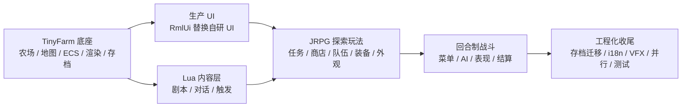
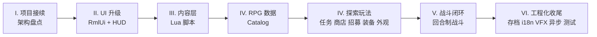

# 开篇：从 TinyFarm 到 TinyFarmRPG

<div class="video-container">
  <div id="bilibili" class="video-content">
    <!-- B站嵌入：使用 https 明确协议（避免 file:// 或 http 导致被浏览器拦截） -->
    <iframe
      class="video-frame"
      title="【C++游戏开发之旅6】迷你农场RPG"
      src="https://player.bilibili.com/player.html?bvid=BV1Yq8q6qEEh&page=1&autoplay=0&danmaku=0&high_quality=1"
      width="100%"
      height="480"
      scrolling="no"
      frameborder="0"
      allowfullscreen>
    </iframe>
  </div>
</div>

[在 Bilibili 上观看](https://www.bilibili.com/video/BV1Yq8q6qEEh/) ｜ [在 YouTube 上观看](https://youtu.be/7r0zyWYICEw)

## 🎮 课程简介

欢迎来到 C++ 游戏开发之旅的第六期课程：《迷你农场 RPG》（TinyFarmRPG）。

你的 TinyFarm 已经能种田、浇水、收获、存档了——农场经营的基本闭环跑得很稳。

但玩了这么久，你是不是隐隐觉得少了点什么？少了**冒险**，少了**故事**，少了"拉几个伙伴组队打一架"的乐趣。

没错，这一期我们就来补齐这些。我们不会推倒重来——而是在你已经熟悉的 TinyFarm 底座上，**一层一层往上盖**，最终盖出一款有剧情、有战斗、有队伍的日式 RPG。

欢迎来到 TinyFarmRPG。

> 📦 **课程配套代码**：[GitHub - TinyFarmRPG](https://github.com/WispSnow/TinyFarmRPG)（完整保留了项目的 Git 提交历史）
>
> 🕹️ **网页版试玩**：[TinyFarmRPG Web Demo](https://wispsnow.github.io/TinyFarmRPG-preview/)
>
> 📝 **作业提交方式**：本课程中的作业统一通过 **GitHub Pull Request（PR）** 提交，便于进行代码评审与学习交流。若你还不熟悉 PR 流程，可先观看这个教程：[PR 教程（Bilibili）](https://www.bilibili.com/video/BV1DdkNBBED2/)。
>
> 📖 **完整文字教程**：本期全部 27 节的文字教程都放在 GitHub 仓库的 [lecture_plans/lectures/](https://github.com/WispSnow/TinyFarmRPG/tree/main/lecture_plans/lectures) 目录中，本站只收录这篇开篇。

---

## 🤖 本期最特别的地方：一个纯 AI 驱动的项目

这一期我们集成了更多商业级第三方库：用 **Lua + sol2** 搭建脚本系统，用 **Effekseer** 制作和播放粒子特效，用 **RmlUi** 构建游戏界面；并且引入了**多线程**，以及针对 RPG 游戏的核心功能实现。

但本项目最特别的地方，并不是如何使用更多的库，或者各种新功能的实现细节。而是——**除少量数值参数调整外，你在视频里看到的功能以及整个项目的代码，都是由 AI 生成的。**

其实我刚开启这个项目时，只是抱着试一试的心态，看看 AI 写 C++ 游戏的效果怎么样，结果发现效果出乎意料的好，于是索性把这个项目的目标设定为**纯 AI 驱动的游戏项目**。

不过，"纯 AI 驱动"并不意味着输入几个提示词，就能自动得到一个近八万行代码的完整项目。想让 AI 持续、稳定地推进这样一个 C++ 游戏，需要一套完整的工作流：

**需求拆解 → 制定计划 → 执行 → 审阅**

我会在后续课程中逐步分享这套方法，其中也包含专门面向学习的环节。所以你不必担心：用了 AI，就学不到东西。

为了让你更容易理解整个开发过程，项目**完整保留了 Git 提交历史**，也记录了文字教程的编写过程。你不仅可以查看最终代码，还可以沿着提交记录，了解项目是怎样一步步完成的。

| 项目规模 | 数值（截至 2026 年 8 月） |
| --- | --- |
| 代码行数 | 近 8 万行（仅统计 `src/`，不含测试、工具与第三方库） |
| 提交次数 | 749 次 |
| 开发跨度 | 2026 年 2 月 → 2026 年 8 月，约半年 |

过去一年我最深的感受是：**AI 正在快速降低技术实现的门槛。** 与单纯"会不会写代码"相比，如何定义问题、做出取舍，以及形成自己的审美和品味，正在变得越来越重要。这也会是这个系列今后重点关注和分享的方向。

---

## 🧭 这节课是干什么的？

简单说：**先让你看清整张地图，再出发。**

读完这节课，你心里应该有个数：

1. TinyFarmRPG 比 TinyFarm 多了哪些东西？为什么不另起炉灶？
2. 整个课程 27 节，按什么节奏推进？每到一个阶段你能拿到什么能力？
3. 正式开始之前，需要补哪些前置知识？

一句话：这节课是整门课的"鸟瞰图"。后面每节课都是在这张图上找一个点往深挖。

---

## 🌾 TinyFarmRPG 长什么样？

在翻开代码之前，先在脑子里搭个轮廓。


### 继承下来的能力

这些是上一期已经建好的，本期**不再重讲底层实现**。课上用到时会简单回顾，但不会展开：

- 🌾 **农场经营**：种植、浇水、收获、物品管理
- 🗺️ **地图系统**：Tiled 地图加载、多地图切换、世界状态
- 🎨 **2D 渲染**：OpenGL + 精灵批处理 + 光照与后处理
- 🎵 **音频**：MiniAudio 驱动的音效与背景音乐
- 🌅 **昼夜循环**：时间系统驱动的环境变化
- 💾 **存档**：游戏状态序列化与读档
- 🧱 **ECS 与场景栈**：EnTT + Scene 栈作为运行时骨架

### 这一期新建的能力

下面是本期的"新东西"，我们会一节课一节课把它们搭起来：

- 📜 **剧情与对话**：分支对白、选项、剧本式 NPC
- 📋 **任务系统**：接任务、追踪目标、回收奖励
- 🛒 **商店系统**：买卖、按状态切换库存
- 👥 **队伍与招募**：从单人农场主到 JRPG 小队
- ⚔️ **装备与成长**：职业、等级、经验、装备属性
- 🧍 **分层角色外观**：可换装、可生成头像
- 🎮 **回合制战斗**：完整的 JRPG 战斗闭环（玩家菜单 + AI + 表现 + 结算）
- 🪄 **Effekseer 特效**：战斗与剧情中的粒子特效
- 🧩 **Lua 内容层**：剧本、对白、剧情触发全部走 Lua 脚本
- 🖼️ **RmlUi 生产 UI**：替换上一期的自研 UI 框架
- 🌍 **本地化**：中英双语 + 跨场景文案管线
- ⚙️ **异步预加载 + 并行调度**：减少切图卡顿、提高 CPU 利用率

### 一张图看懂继承关系



可以看到，整个开发顺序是从"打地基"到"起高楼"再到"装修"——UI 和 Lua 内容层是基础能力，先建好；然后往上搭探索玩法；最后收尾战斗和工程化。

---

## 📚 怎么学？——延续上期，再往前走一步

[上一期](/courses/opengl-tiny-farm)我们已经约定了两条规则：**不再逐行讲代码**、**基于完整工程剖析**。本期继续沿用，并在此基础上再往前推一步。

为什么？因为 TinyFarm 已经接近 5 万行，TinyFarmRPG 还要再往上加——如果继续"手把手敲每一行"，节奏会被拖得非常慢。而且说实话，工作中你接手的大概率也是这种规模的项目。读懂、改对、扩好，才是真本事。

所以这一期我们会这样学：

- **架构优先，细节留阅读清单。** 每节课只挑关键类和关键流程讲透，剩下的通过源码入口和练习引导你自己去读。
- **聚焦"新增能力"。** 上一期讲过的内容只在建立上下文时快速回顾，不重复展开。你需要时翻上一期教程就好。
- **先看再讲。** 架构类的内容尽量给你可操作的入口——调试面板、可视化工具、DOT 图导出——而不是让你盯着一堆抽象架构图发呆。
- **外链子教程。** RmlUi 和多线程有独立的子教程，主线只讲"项目里怎么用"，原理层面的细节戳外链去看。

> 也就是说，这门课不是"跟着敲一遍"，而是"带着你去读一个真实项目，搞清楚它是怎么设计的，为什么这么设计，然后你能自己改、自己扩。"

---

## 🗺️ 课程路线图：6 个阶段，27 节课

这一期的 27 节课分成 6 个阶段。每个阶段收束时，你都能拿到一个可感知的能力增量。

### 阶段 I · 项目接续与架构基础

先帮你建立"新项目的心智模型"。我们不会一上来就写代码，而是把整个项目的架构地图铺开：engine / game / domain / script 四层分别是什么？"声明式装配"是什么？为什么要把"new 一切"的模式改掉？完成这个阶段后，你会对整个项目的骨架有一个清晰的认识。

> 这个阶段包含第 0 节到第 2 节（本节 + [游戏架构设计](https://github.com/WispSnow/TinyFarmRPG/blob/main/lecture_plans/lectures/01-游戏架构设计.md) + [领域服务与命令事件边界](https://github.com/WispSnow/TinyFarmRPG/blob/main/lecture_plans/lectures/02-领域服务与命令事件边界.md)）。

### 阶段 II · 生产 UI 与输入升级

上一期的自研 UI 框架在这一期被 RmlUi 彻底替换。这三节课不讲 RML/RCSS 语法（那在子教程里），而是讲"项目层面怎么接入 RmlUi"——HUD 架构、覆盖式弹出场景、输入上下文管理。学完你会理解：为什么 RmlUi 能让 UI 开发和游戏逻辑解耦。

> 这个阶段包含 [RmlUi 接入](https://github.com/WispSnow/TinyFarmRPG/blob/main/lecture_plans/lectures/03-RmlUi接入.md)、[HUD 与覆盖式场景](https://github.com/WispSnow/TinyFarmRPG/blob/main/lecture_plans/lectures/04-HUD与覆盖式场景.md)、[输入上下文与菜单导航](https://github.com/WispSnow/TinyFarmRPG/blob/main/lecture_plans/lectures/05-输入上下文与菜单导航.md)。

### 阶段 III · Lua 内容层

这是本期最"不一样"的一个模块。NPC 对白、任务分支、剧情触发——这些不再硬编码在 C++ 里，而是放到 Lua 脚本中。这三节课带你从 ScriptHost 的内核一路看到脚本事件桥，搞清楚"C++ 负责规则真相，Lua 负责内容编排"这条边界是怎么落地的。

> 这个阶段包含 [Lua 内容层总览](https://github.com/WispSnow/TinyFarmRPG/blob/main/lecture_plans/lectures/06-Lua内容层总览.md)、[ScriptHost 与 Sol2 绑定](https://github.com/WispSnow/TinyFarmRPG/blob/main/lecture_plans/lectures/07-ScriptHost与Sol2绑定.md)、[脚本事件桥与 Tiled 接入](https://github.com/WispSnow/TinyFarmRPG/blob/main/lecture_plans/lectures/08-脚本事件桥与Tiled接入.md)。

### 阶段 IV · RPG 数据与探索玩法

进入"玩法"正题。先讲数据目录（Catalog）——物品、职业、技能、敌人这些静态数据是怎么组织的；然后依次展开任务系统、商店系统、队伍与招募、装备与成长、分层角色外观。这个阶段结束后，你的游戏里已经有了一个可以探索、接任务、买东西、组队伍的 JRPG 世界。

> 这个阶段包含 [数据目录与 RPG Catalog](https://github.com/WispSnow/TinyFarmRPG/blob/main/lecture_plans/lectures/09-数据目录与RPG-Catalog.md) 到 [分层角色外观与头像](https://github.com/WispSnow/TinyFarmRPG/blob/main/lecture_plans/lectures/14-分层角色外观与头像.md) 共 6 节。

### 阶段 V · 回合制战斗

这是整期课程的核心重头戏。6 节课从战斗入口、领域核心、动作解析，到玩家菜单、AI 决策、战斗表现、结算奖励，搭出一个**最小可玩的回合制战斗闭环**。这个阶段的代码量最大，但也最能体现"领域驱动设计"的价值。

> 这个阶段包含 [探索与战斗的过渡](https://github.com/WispSnow/TinyFarmRPG/blob/main/lecture_plans/lectures/15-探索与战斗的过渡.md) 到 [战斗结算与探索态写回](https://github.com/WispSnow/TinyFarmRPG/blob/main/lecture_plans/lectures/20-战斗结算与探索态写回.md) 共 6 节。

### 阶段 VI · 工程化收尾

功能都有了，该收尾了。存档 schema 迁移、中英双语本地化、Effekseer 特效接入、异步预加载、并行调度优化、测试覆盖——这些是让项目从"能跑"到"能上线"的关键工程步骤。

> 这个阶段包含第 21 节到第 26 节（[存档](https://github.com/WispSnow/TinyFarmRPG/blob/main/lecture_plans/lectures/21-存档系统与Schema迁移.md)、[本地化](https://github.com/WispSnow/TinyFarmRPG/blob/main/lecture_plans/lectures/22-本地化与用户设置.md)、[VFX](https://github.com/WispSnow/TinyFarmRPG/blob/main/lecture_plans/lectures/23-Effekseer与VFX管线.md)、[异步](https://github.com/WispSnow/TinyFarmRPG/blob/main/lecture_plans/lectures/24-异步地图预加载与主线程命令队列.md)、[并行](https://github.com/WispSnow/TinyFarmRPG/blob/main/lecture_plans/lectures/25-SystemScheduler与并行岛.md)、[测试](https://github.com/WispSnow/TinyFarmRPG/blob/main/lecture_plans/lectures/26-调试测试与课程收尾.md)）。



> 完整的逐节大纲见仓库中的 [`tinyfarmrpg-course-outline.md`](https://github.com/WispSnow/TinyFarmRPG/blob/main/lecture_plans/tinyfarmrpg-course-outline.md)。等你读完这节课，可以去翻一翻，对每一节的具体内容有个大概印象。各节的文字教程都在仓库的 [lecture_plans/lectures/](https://github.com/WispSnow/TinyFarmRPG/tree/main/lecture_plans/lectures) 目录中。

---

## 📖 每节课怎么读？

为了保持架构课的节奏，每节课都按统一的结构来组织。你可以提前知道每个段落的"用途"，方便取舍——时间紧就先看目标和源码入口，时间充裕就从头读到尾。

**本课目标** — 一句话告诉你"学完能做什么"。如果学完发现回答不了目标里的问题，说明需要回头重看。

**关键链路** — 一张 mermaid 图，把本节课涉及的跨模块数据流或事件流串起来。先看图，再看字——图能帮你在脑子里建索引。

**核心知识点** — 3 到 6 条，每条围绕"为什么这样做"来展开，而不只是列"做了什么"。这是我们花最多笔墨的地方。

**阅读清单** — 项目内 docs + 上一期相关章节 + 子教程外链。不用全读，按需查阅。

**源码入口** — 3 到 5 个文件，按优先级排列。我们选文件的原则是"读完这几个就能动手改"。

**自测问题** — 3 到 4 个开放问题。能在心里口头回答出来，就可以视为理解了。不需要写长篇答案。

**最小练习** — 一个 30 到 60 分钟的小任务。可能是改一行代码观察效果变化，也可能是用调试面板查看某个数据流。

**建议的阅读节奏**：先扫一遍目标、知识点和源码入口，然后打开项目里对应的文件，配合本课文字一起看。最后用自测问题反向验证理解，再决定要不要做练习。**不要在没打开项目的情况下逐字读完全文**——那样效率很低。

---

## 📂 先逛逛项目目录

第一次打开 TinyFarmRPG 仓库，不用每个目录都点开。先认识几个"门牌号"，剩下的等具体课程用到时再深入。

```
TinyFarmRPG/
├── src/
│   ├── engine/        # 与玩法无关的基础设施
│   │   ├── core/      #   GameApp / Context / 配置
│   │   ├── scene/     #   Scene 栈
│   │   ├── render/    #   渲染管线
│   │   ├── ui/        #   RmlUi 运行时
│   │   ├── script/    #   Lua VM 与安全边界
│   │   ├── vfx/       #   Effekseer 后端
│   │   └── ...        #   audio / input / resource / async ...
│   ├── game/          # TinyFarmRPG 特定玩法
│   │   ├── runtime/   #   声明式装配（catalog / service / system）
│   │   ├── scene/     #   Title / GameScene / 各覆盖式 UI 场景
│   │   ├── domain/    #   领域服务（Inventory / Quest / Shop ...）
│   │   ├── battle/    #   回合制战斗领域核心
│   │   ├── script/    #   tf.* Lua API 绑定
│   │   └── ...        #   component / system / data / save ...
│   └── main.cpp       # 极薄入口——只有一行 game::run()
├── assets/data/       # JSON 数据目录（catalog 都在这里）
│   ├── rpg/           #   actors / classes / skills / states / equipment / enemies / troops
│   ├── quests.json
│   ├── shops.json
│   └── ...
├── scripts/           # Lua 内容脚本
│   ├── bootstrap.lua  #   内容组合根
│   ├── lib/           #   共享工具（state / once / dialogue ...）
│   ├── maps/          #   地图事件
│   ├── npcs/          #   NPC 对白
│   └── quests/        #   任务脚本
├── ui/rmlui/          # RmlUi 文档与样式
│   ├── theme/         #   全局主题
│   ├── hud/           #   常驻 HUD
│   ├── scenes/        #   覆盖式弹出场景
│   └── overlay/       #   叠加层
├── docs/              # 项目文档（engine / game / gameplay / tutorial）
├── tests/             # Google Test 测试
├── tools/             # 调试与验证工具
└── for_agent/         # 编码规范（AI 辅助开发用）
```

如果你从上一期过来，会发现三个"新面孔"：**`assets/data/rpg/`**（RPG 规则数据）、**`scripts/`**（Lua 内容层）、**`ui/rmlui/`**（生产 UI）。这三个目录上一期都没有，是本期反复出现的主干道，先混个眼熟。

---

## 📋 开始之前：你需要准备什么？

坦率地说，这门课**不是从零开始**。它假设你已经完整跟完了上一期[《OpenGL 与迷你农场》](/courses/opengl-tiny-farm)。如果你是从上一期一路走过来的，下面的要求应该都能满足。

### 必须准备好的

- **上一期[《OpenGL 与迷你农场》](/courses/opengl-tiny-farm)全部内容**。本期不再重讲 C++ 基础、ECS 概念、渲染管线、农场逻辑。遇到相关内容时我们会简单回顾，但不会展开。
- **[RmlUi 子教程](https://github.com/WispSnow/TinyFarmRPG/blob/main/learn/lectures/rmlui/syllabus.md)前 6 节**（文档结构、盒模型、布局、样式、事件、数据绑定）。主线的 [RmlUi 接入](https://github.com/WispSnow/TinyFarmRPG/blob/main/lecture_plans/lectures/03-RmlUi接入.md) 一节只讲"项目如何接入 RmlUi"，不重复语法。如果你直接跳到那节课，会看不懂 RML/RCSS 文件。所以建议把它当"开课前的暑假作业"先过一遍。

### 可以边学边补的

- **RmlUi 子教程后 9 节**（自定义元素、动画、JRPG 实战）。不需要一开始就啃完，[RmlUi 接入](https://github.com/WispSnow/TinyFarmRPG/blob/main/lecture_plans/lectures/03-RmlUi接入.md)、[HUD 与覆盖式场景](https://github.com/WispSnow/TinyFarmRPG/blob/main/lecture_plans/lectures/04-HUD与覆盖式场景.md)、战斗相关课程的阅读清单会点名具体章节，用到再补。
- **[多线程子教程](https://github.com/WispSnow/TinyFarmRPG/blob/main/docs/tutorial/multi-thread/README.md)**。存档、异步、并行相关课程会指明配套章节，到时候再看就行。

### 技术基础

和上一期的要求一致：
- 熟悉现代 C++（C++20 常用特性），能独立阅读中等复杂度的工程代码
- 理解游戏循环、事件、ECS、Scene 等基本概念
- 完成过上一期 TinyFarm 项目，或具备等价工程经验

> 如果你某个前置还不太熟——没关系。上面标注了"必须准备好"和"可以边学边补"，按优先级来就行。不要让"完美准备"成为拖延的借口。

---

## 🔗 与上一期的关系

上一期的内容在这一期里有四种不同的"待遇"：

- **回顾** —— 本期会再次提到，用来给新内容做对照。比如上一期的[架构设计（part-02）](/courses/opengl-tiny-farm/parts/part-02)会在本期的 [游戏架构设计](https://github.com/WispSnow/TinyFarmRPG/blob/main/lecture_plans/lectures/01-游戏架构设计.md) 一节对齐。
- **升级** —— 上一期的能力本期大幅扩展。比如[存档（part-32）](/courses/opengl-tiny-farm/parts/part-32)在本期存档课程会加上 schema 迁移和异步写入。
- **替换** —— 上一期的方案被新方案彻底取代。比如自研 UI（[part-17](/courses/opengl-tiny-farm/parts/part-17)、[part-18](/courses/opengl-tiny-farm/parts/part-18)）被 RmlUi（本期 [RmlUi 接入](https://github.com/WispSnow/TinyFarmRPG/blob/main/lecture_plans/lectures/03-RmlUi接入.md) 一节）替换。
- **略过** —— 上一期已经讲透了，本期不再涉及。比如渲染细节（part-09 到 part-12）。

完整的对照表见[大纲中"与上一套教程的衔接"一节](https://github.com/WispSnow/TinyFarmRPG/blob/main/lecture_plans/tinyfarmrpg-course-outline.md#与上一套教程的衔接)。

---

## 🧰 技术栈速览

相比上一期，本期新增或升级的技术用 **加粗** 标出来了：

| 类别 | 技术 |
| --- | --- |
| 核心语言 | C++20 |
| 构建工具 | CMake 3.13+ |
| 图形 / 平台 | SDL3 + OpenGL + GLAD |
| ECS 框架 | EnTT 3.16.0 |
| **生产 UI** | **RmlUi 6.2**（替换上期自研 UI） |
| 调试 UI | ImGui |
| 字体渲染 | FreeType 2.14.1 + HarfBuzz 12.1.0 |
| 音频 | MiniAudio |
| 数学库 | GLM 1.0.1 |
| 日志库 | spdlog 1.15.3 |
| JSON 解析 | nlohmann-json 3.12.0 |
| **脚本宿主** | **Lua 5.4.8 + Sol2 v3.5.0**（新增） |
| **粒子特效** | **Effekseer 1.80.6**（新增） |
| 测试框架 | GoogleTest 1.17.0 |
| 关卡编辑 | Tiled |

---

## 📎 配合阅读

| 顺序 | 文件 / 章节 | 看什么 |
| :---: | --- | --- |
| 1 | [`docs/overview.md`](https://github.com/WispSnow/TinyFarmRPG/blob/main/docs/overview.md) | 项目定位、核心架构原则、Lua 内容层约定 |
| 2 | 上一期 [00-开篇](/courses/opengl-tiny-farm/parts/intro) | 回忆 TinyFarm 的项目定位 |
| 3 | 上一期 [01-构建与运行](/courses/opengl-tiny-farm/parts/part-01) | 复习 CMake 构建与运行时资源约定（本期不再重讲） |
| 4 | [`tinyfarmrpg-course-outline.md`](https://github.com/WispSnow/TinyFarmRPG/blob/main/lecture_plans/tinyfarmrpg-course-outline.md) | 完整逐节大纲 |

---

## 🔍 从这几个文件开始看

只看这几个，建立"入口有多薄"的直觉就够了。具体实现留到后续课程：

| 顺序 | 文件 | 你会看到什么 |
| :-: | --- | --- |
| 1 | [`src/main.cpp`](https://github.com/WispSnow/TinyFarmRPG/blob/main/src/main.cpp) | 整个入口只有一行：`game::run()` |
| 2 | [`src/game/game_entry.cpp`](https://github.com/WispSnow/TinyFarmRPG/blob/main/src/game/game_entry.cpp) | `game::run()` 如何创建 `GameApp` 并注册初始场景 |
| 3 | [`src/game/game_entry.h`](https://github.com/WispSnow/TinyFarmRPG/blob/main/src/game/game_entry.h) | `game` 命名空间下 `run()` 的声明 |
| 4 | [`src/engine/core/`](https://github.com/WispSnow/TinyFarmRPG/tree/main/src/engine/core) | `GameApp` 与 `Context`，主循环骨架的归属 |

打开 `main.cpp` 看一看——整个入口只有一行。这种"薄入口"模式从上一期就在用，本期延续。它的好处是：入口越薄，测试和脚本就越容易介入。

---

## ✅ 检查你的理解

读完这节课，试试在心里回答这几个问题：

1. **TinyFarmRPG 比 TinyFarm 主要多了哪 5 个玩法系统？** 如果按"对玩家可见性"排序，哪个最显眼？
2. **为什么不推倒重来？** 把"在旧底座上扩建"作为前提，会给后续开发带来哪些约束？（提示：架构边界、旧系统接口、目录组织……）
3. **为什么把课程拆成 6 个阶段？** 如果让你把 RmlUi 接入和战斗入口的顺序对调，会发生什么问题？

---

## 🛠️ 动手试试

三道小练习，总共大约 30 分钟：

1. **跑通项目**：参照[上一期第 1 节课](/courses/opengl-tiny-farm/parts/part-01)的步骤（或仓库 README 中的构建指南），完成 configure → build → run，确认能进入 TinyFarmRPG 的标题画面。这是最重要的一步——项目跑不起来，后面都白搭。
2. **浏览 [`docs/overview.md`](https://github.com/WispSnow/TinyFarmRPG/blob/main/docs/overview.md)**：重点读"核心架构原则"和"Lua 内容层约定"两节。不用全看懂，先留个印象。
3. **写下你的"拆解清单"**：对照上面的阶段总览，在自己的笔记里写下**你最想先拆开看的 3 个系统**，并各写一句理由。后面每节课开始前回头翻一翻，看你的好奇心是否被解答了。

---

## 📝 小结

回到开头那三个问题：

1. **新增了什么？** 在 TinyFarm 农场底座上，我们叠加了剧情对话、任务、商店、队伍、装备、外观、回合制战斗、Lua 内容层、RmlUi 生产 UI、Effekseer 特效、本地化等一整套系统。
2. **怎么拆？** 6 个阶段、27 节课，从"项目接续"一路走到"工程化收尾"。每一节都讲清楚"为什么这样做"，而不只是"做了什么"。
3. **怎么准备？** 完整跟完上一期 TinyFarm，提前过一遍 RmlUi 子教程前 6 节，就可以开始下一节 [游戏架构设计](https://github.com/WispSnow/TinyFarmRPG/blob/main/lecture_plans/lectures/01-游戏架构设计.md) 了。

地图铺好了，我们出发吧。

---

## 📖 后续课程在哪里？

本期的文字教程不在本站逐节发布，全部 27 节都放在 GitHub 仓库的 [lecture_plans/lectures/](https://github.com/WispSnow/TinyFarmRPG/tree/main/lecture_plans/lectures) 目录中，按文件编号顺序阅读即可。下一节是 [01-游戏架构设计](https://github.com/WispSnow/TinyFarmRPG/blob/main/lecture_plans/lectures/01-游戏架构设计.md)。
